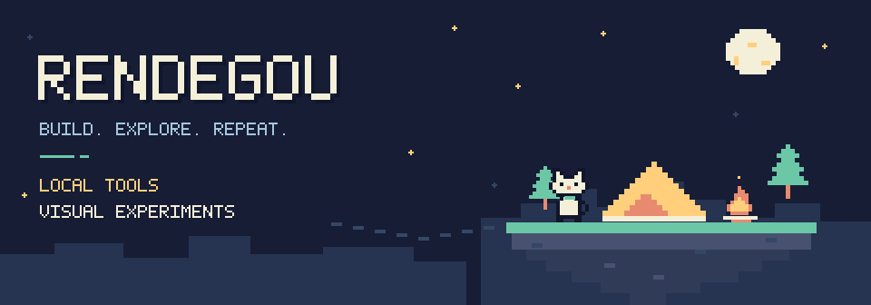

<picture>
  <source media="(prefers-reduced-motion: reduce)" srcset="assets/camp.svg">
  
</picture>

## 项目

### [Local AI Chat Manager](https://github.com/Rendegou/local-ai-chat-manager)

**把散落的 AI 编程会话收进一个本地工具。** 浏览、全文搜索与增量索引，支持通过独立 Git 仓库同步会话副本。

`Tauri 2` `Rust` `React` `SQLite FTS5` · **Beta**

### [BYTESPACE](https://github.com/Rendegou/bytespace)

**如果文件可以变成一座城？** 本地采样文件字节，把特征映射为城市描述符，再用 Canvas 2D 画出等距预览。

`TypeScript` `React` `Canvas 2D` · **M0 Demo**

### [PULSE](https://github.com/Rendegou/pulse)

**走进一片能互动的粒子海。** 漫游、靠近并共同照料植物，用 Canvas / WebGL 绘制世界，用 Go / WebSocket 同步连接与植物状态。

`Vue 3` `Go` `WebSocket` `Canvas / WebGL` · **实验项目**

## 开源探索

[DBX](https://github.com/Rendegou/dbx) — 跨平台数据库客户端，Fork 自 [t8y2/dbx](https://github.com/t8y2/dbx)。

[ATLAS](https://github.com/Rendegou/ATLAS) — 本地 coding agent，Fork 自 [inferstep/ATLAS](https://github.com/inferstep/ATLAS)。

---

<samp>感谢来访，欢迎交流项目与想法。</samp>

